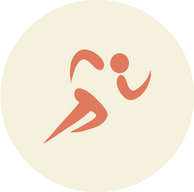

    

# Sculptr

## Exercise For Humans

## Table of Contents

1. [Description](#description)
2. [Features](#features)
3. [Getting Started](#getting-started)
   - [Prerequisites](#prerequisites)
   - [Installation](#installation)
4. [Contributors](#contributors)
5. [License](#license)
6. [Acknowledgements](#acknowledgements)

## Description

🏋️‍♂️Sculptr is your ultimate fitness companion, tailored for enthusiasts ranging from beginners to pros. Whether you're on a mission to shed some pounds, bulk up with muscles, enhance your flexibility, or prep for that upcoming marathon, Sculptr has got you covered!

Join us on this transformative journey and let Sculptr carve the best version of you!

Feel free to customize or tweak it further to better fit your application's essence.

## Features

- 🏆 **Goal-Oriented Workouts:** Create workouts that align with your ambitions! Whether it's weight loss, muscle gain, or improving agility, we have suggestions and templates ready for you.
- 📈 **Track Your Progress:** Witness your transformation in real-time with our progress trackers. From calories burned to the miles run, keep an eye on every step forward.
- 🌄 **Earn Badges:** As you crush your goals, earn badges to celebrate each milestone. Let each badge be a testament to your dedication and hard work.

## Built With:

-  [Python](https://docs.python.org/3/)
-  [FastAPI](https://fastapi.tiangolo.com/)
-  [Docker](https://docs.docker.com/)
-  [PostgreSQL](https://www.postgresql.org/docs/)
-  [Sass](https://sass-lang.com/)

## Getting Started

### Prerequisites

- Python 3.11.3
- Docker 24.0.2

### Installation

1. Get an API Key from [API Ninjas](https://api-ninjas.com/)

1. Clone the repo:
   git clone https://gitlab.com/goldnine/sculptr-app.git

1. Navigate to the directory:
   cd sculptr-app

1. Set up Docker:
   docker-compose up --build

## Contributors

- **Anaka Norfleet** - [Profile](https://gitlab.com/fleetster22)
- **Michael Parnapy** - [Profile](https://gitlab.com/Michael5331)
- **Priya Patel** - [Profile](https://gitlab.com/prip886)

## License

This project is licensed under the [MIT License](https://choosealicense.com/licenses/mit/).
